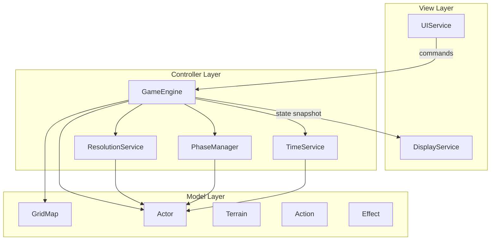
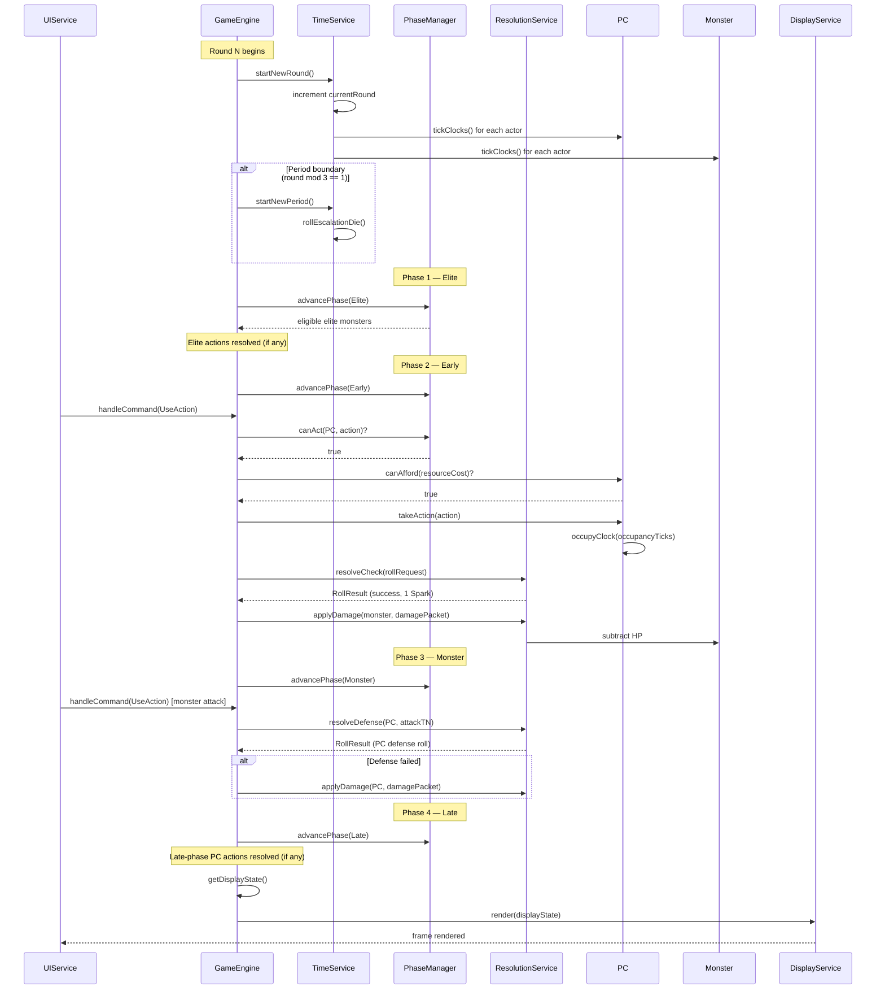

# SDD: Hackfinder Game Engine — Class Diagram

**Version:** 0.1  
**Status:** Draft  
**Source rules:** [gameRules/version_0.01.md](../gameRules/version_0.01.md)  
**Language:** Language-agnostic UML (no implementation target yet)

---

## 1. Purpose

This document defines the object-oriented class model for the Hackfinder game engine. It translates the rules in `version_0.01.md` into a formal architecture before any code is written. The design follows MVC layering: **Model** (data), **Controller** (rules and orchestration), **View** (input/output services with no rule knowledge).

---

## 2. Architecture Overview

### 2.1 MVC Layers

| Layer | Classes | Responsibility |
|-------|---------|----------------|
| **View** | `UIService`, `DisplayService` | Capture user input and render output. Must not contain game-rule logic. |
| **Controller** | `GameEngine`, `PhaseManager`, `TimeService`, `ResolutionService` | Orchestrate combat flow, enforce rules, resolve checks. |
| **Model** | `Actor`, `GridMap`, `Terrain`, `Action`, `Effect` | Hold game state and domain data. |

### 2.2 Data Flow



**Constraint:** `DisplayService` receives a `DisplayState` snapshot only. It must not import or reference game-rule classes. `GameEngine` is the sole authority on rules.

### 2.3 Suggested Module Layout (language-agnostic)

When an implementation language is chosen, mirror this structure:

```
engine/
  core/           GameEngine, GameState, Command
  phases/         PhaseManager, CombatPhase
  time/           TimeService, ActionClock
  resolution/     ResolutionService, RollRequest, RollResult, DamagePacket
  model/
    actors/       Actor, PC, Monster, NPC, Attributes, VitalPools
    actions/      Action, ActionRegistry
    effects/      Effect, Condition
    grid/         GridMap, Coord, Terrain, shapes/
    progression/  (deferred) CharacterBuild, Core, Archetype
  services/
    ui/           UIService
    display/      DisplayService, DisplayState
```

---

## 3. Core Class Diagram

```mermaid
classDiagram
    direction TB

    class GameEngine {
        -GridMap map
        -PhaseManager phaseManager
        -TimeService timeService
        -ResolutionService resolutionService
        -List~Actor~ actors
        -GameState state
        +start()
        +tick()
        +handleCommand(command)
        +getDisplayState() DisplayState
    }

    class PhaseManager {
        -CombatPhase currentPhase
        +advancePhase()
        +getEligibleActors(phase) List~Actor~
        +canAct(actor, action) bool
    }

    class TimeService {
        -int currentRound
        -int currentPeriod
        -int escalationDie
        +tickClocks()
        +startNewRound()
        +startNewPeriod()
        +rollEscalationDie()
    }

    class ResolutionService {
        +resolveCheck(rollRequest) RollResult
        +resolveDefense(defenseRequest) RollResult
        +applyDamage(target, damagePacket)
        +spendSpark(actor, menuOption)
        +spendShadow(gm, effect)
    }

    class UIService {
        +pollInput() Command
    }

    class DisplayService {
        +render(displayState)
    }

    class GridMap {
        -int width
        -int height
        -Map~Coord,Terrain~ cells
        +place(actor, coord)
        +getActorsInShape(shape) List~Actor~
        +plotShape(shape) List~Coord~
    }

    class Actor {
        <<abstract>>
        #string id
        #string name
        #Attributes attributes
        #VitalPools vitals
        #List~Action~ knownActions
        #List~Effect~ activeEffects
        #List~ActionClock~ clocks
        +takeAction(action)
        +canAfford(cost) bool
        +applyEffect(effect)
    }

    class PC {
        +ProficiencyTable proficiencies
        +CharacterBuild build
    }

    class Monster {
        +bool isElite
        +MonsterPacing pacing
    }

    class NPC {
        +Disposition disposition
    }

    class Attributes {
        +int might
        +int agility
        +int mind
        +int spirit
        +getDefense(attr) int
    }

    class VitalPools {
        +int hp
        +int ep
        +int sp
        +int stamina
        +int mana
    }

    class Action {
        +string id
        +string name
        +PhaseTrait phaseTrait
        +ActionCostTier costTier
        +ResourceCost resourceCost
        +int occupancyTicks
        +DurationType duration
        +List~Tag~ tags
        +ShapeTemplate targetShape
        +execute(context) ActionResult
    }

    class ActionRegistry {
        +register(action)
        +get(id) Action
        +getAll() List~Action~
    }

    class ActionClock {
        +int remainingTicks
        +Action occupiedBy
        +bool isOccupied()
        +clear()
    }

    class Effect {
        <<abstract>>
        +DurationType duration
        +bool isExpired(roundContext) bool
        +onApply(actor)
        +onTick(actor)
        +onRemove(actor)
    }

    class Condition {
        +string name
        +applyModifiers(modifiers)
    }

    class Terrain {
        +TerrainType type
        +List~Tag~ elementalTags
        +blocksMovement bool
    }

    class RollRequest {
        +Actor roller
        +int targetNumber
        +int modifiers
        +ProficiencyLevel proficiency
    }

    class RollResult {
        +int naturalRoll
        +int total
        +bool success
        +int sparksEarned
        +int shadowsEarned
    }

    class DamagePacket {
        +DamageType type
        +int amount
        +List~Tag~ tags
        +Actor source
    }

    class ShapeTemplate {
        <<abstract>>
        +getAffectedCoords(origin, facing) List~Coord~
    }

    class Sphere
    class Cone45
    class Path

    Actor <|-- PC
    Actor <|-- Monster
    Actor <|-- NPC
    Effect <|-- Condition
    ShapeTemplate <|-- Sphere
    ShapeTemplate <|-- Cone45
    ShapeTemplate <|-- Path

    GameEngine --> PhaseManager
    GameEngine --> TimeService
    GameEngine --> ResolutionService
    GameEngine --> GridMap
    GameEngine --> Actor
    ActionRegistry --> Action
    Actor *-- Attributes
    Actor *-- VitalPools
    Actor *-- ActionClock
    Actor o-- Action
    Actor o-- Effect
    Action --> ShapeTemplate
    Action --> Tag
    GridMap o-- Terrain
    ResolutionService --> RollRequest
    ResolutionService --> RollResult
    ResolutionService --> DamagePacket
```



---

## 4. Per-Class Responsibilities

| Class | Layer | Responsibility |
|-------|-------|----------------|
| `GameEngine` | Controller | Master state machine and main loop. Owns all actors and services. Routes commands, advances rounds/phases, produces `DisplayState`. |
| `GameState` | Controller | Enum or value object tracking encounter lifecycle (Setup, InCombat, Paused, Ended). |
| `PhaseManager` | Controller | Tracks current `CombatPhase`. Determines which actors may act and validates action phase traits. |
| `TimeService` | Controller | Manages round counter, PC action clock tick-down, GM Periods (3 rounds), and Escalation Die rolls. |
| `ResolutionService` | Controller | All D20 math: checks vs TN, defense rolls, Sparks/Shadows generation, damage application, meta-currency spending. |
| `UIService` | View | Polls hardware input (keyboard, mouse, network). Returns `Command` objects to `GameEngine`. |
| `DisplayService` | View | Renders a `DisplayState` snapshot. Swappable backend (ASCII, Pygame, web). |
| `GridMap` | Model | 2D coordinate space. Actor placement, terrain lookup, geometric shape plotting. |
| `Coord` | Model | Immutable (x, y) grid coordinate value object. |
| `Actor` | Model | Abstract base for all combatants. Composes attributes, vitals, clocks, actions, and effects. |
| `PC` | Model | Player character. Adds proficiency table and character build reference. |
| `Monster` | Model | Enemy combatant. Adds `isElite` flag and `MonsterPacing` (period/escalation budget). |
| `NPC` | Model | Non-combat or narrative actor. Adds disposition (friendly, neutral, hostile). |
| `Attributes` | Model | Four core attributes: Might, Agility, Mind, Spirit. Provides defense lookups. |
| `VitalPools` | Model | Five resource pools: HP, EP, SP, Stamina, Mana. |
| `Action` | Model | Encapsulates one game action: phase trait, cost, occupancy, tags, target shape, and `execute()`. |
| `ActionRegistry` | Model | Central catalog of all defined actions. Lookup by ID. |
| `ActionClock` | Model | One PC action clock. Tracks remaining ticks and which action occupies it. |
| `Effect` | Model | Abstract timed or triggered modifier on an actor. Handles duration expiry. |
| `Condition` | Model | Concrete `Effect` subclass for named debuffs/buffs (e.g., Challenged, Stance). |
| `Terrain` | Model | Grid cell terrain: type, elemental tags, movement blocking. |
| `ShapeTemplate` | Model | Abstract geometric area-of-effect template (Sphere, Cone45, Path). |
| `RollRequest` | Model | Input DTO for a single D20 check. |
| `RollResult` | Model | Output DTO: natural roll, total, success, Sparks/Shadows earned. |
| `DamagePacket` | Model | Typed damage payload: type, amount, tags, source actor. |
| `ProficiencyTable` | Model | Maps skill/action categories to `ProficiencyLevel`. |
| `CharacterBuild` | Model | (Deferred) Core, Archetypes, Ancestry, level, feat selections. |
| `MonsterPacing` | Model | Tracks GM period action budget (Light/Moderate/Heavy spent this period). |
| `DisplayState` | View DTO | Immutable render snapshot: grid, actor positions, HP bars, phase, round. |
| `Command` | View DTO | User intent from `UIService`: UseAction, MoveActor, SpendSpark, EndPhase, etc. |

---

## 5. Enums and Value Objects

### 5.1 `CombatPhase`

The four synchronous phases per round. One full cycle = 1 Round (1 Tick).

| Value | Description |
|-------|-------------|
| `Elite` | Elite monsters only. Actions with Elite trait. |
| `Early` | PCs execute Early-trait actions. |
| `Monster` | Standard (and optionally Elite) monsters act. |
| `Late` | PCs execute Late-trait actions. |

### 5.2 `PhaseTrait`

Tag on an `Action` indicating when it may be used.

| Value | Used by | Description |
|-------|---------|-------------|
| `Elite` | Elite monsters | Elite Phase only. |
| `Early` | PCs | Early Phase. |
| `Late` | PCs | Late Phase. |
| `Quick` | Monsters (non-budget rounds), PCs | Minor actions usable while clocks are on cooldown. |

### 5.3 `ActionCostTier`

Resource cost category for an action.

| Value | Resource cost |
|-------|---------------|
| `AtWill` | 0 |
| `Light` | 2 Stamina or Mana |
| `Moderate` | 4 resources |
| `Heavy` | 6 resources |

### 5.4 `DurationType`

How long an effect or action consequence persists.

| Value | Tracking behavior |
|-------|-------------------|
| `Instantaneous` | No tracking. Applied and done. |
| `TickBound` | Expires at end of next tick (1–2 rounds max). |
| `ClockBound` | Lasts while a player clock remains intentionally occupied. |
| `EventBased` | Until a specific trigger or counteract roll clears it. |
| `EncounterLong` | Until encounter ends (e.g., Stances). |
| `Daily` | Until one in-game day passes. |
| `DowntimeBound` | Until a Long Rest (1 full week of downtime). |

Engine v0.1 implements `Instantaneous` through `EncounterLong` only.

### 5.5 `DamageType`

Capital-D damage types. Subtract from HP or SP only.

| Value | Targets | Notes |
|-------|---------|-------|
| `Kinetic` | HP | Mitigated by physical armor dice. |
| `Energy` | HP | Non-physical baseline. |
| `Explosive` | HP | Ignores PC physical armor dice. |
| `Cognitive` | Monster HP / Player SP | Bypasses player HP entirely. |
| `Lingering` | HP | Damage over time. Requires time/event to clear. |

### 5.6 `ProficiencyLevel`

Access rights and modifier for checks.

| Value | Modifier | Notes |
|-------|----------|-------|
| `Untrained` | +0 (with -5 penalty on use) | Cannot access restricted gear or Spark Menus. |
| `Trained` | +2 | Base access rights. |
| `Expert` | +4 | Unlocks advanced Spark Menus. |
| `Master` | +6 | Top-tier gear access. |
| `Legendary` | +8 | Maximum proficiency. |

### 5.7 `Tag`

Narrative and mechanical labels on actions, damage, and terrain. Tags drive environmental interactions and **which Spark Menu unlocks** on a +5-over-TN roll.

Examples: `Area`, `Fire`, `Void`, `Slashing`, `Toxin`, `Knockback`, `Bludgeoning`, `Concussive`.

Implemented as a string enum or sealed set. New tags can be added without changing core engine classes.

### 5.8 `TerrainType`

Classification for grid cells.

Examples: `Open`, `Difficult`, `Obstacle`, `ElementalZone`.

Elemental zones carry additional `Tag` values (e.g., `Fire`, `Void`).

### 5.9 `ResourceCost`

Value object specifying which vital pools an action consumes.

```
ResourceCost {
  stamina?: int
  mana?: int
  sp?: int
  ep?: int
}
```

At least one pool may be set. `Action.canAfford()` checks against `VitalPools`.

### 5.10 `Disposition`

NPC attitude classification.

| Value | Description |
|-------|-------------|
| `Friendly` | Allied or cooperative. |
| `Neutral` | Non-combatant by default. |
| `Hostile` | May enter combat. |

### 5.11 `DisplayState`

Immutable snapshot produced by `GameEngine.getDisplayState()`. Consumed only by `DisplayService`.

```
DisplayState {
  grid: GridSnapshot          // cells, terrain icons, dimensions
  actors: List<ActorSnapshot> // id, name, position, hp/maxHp, status icons
  currentPhase: CombatPhase
  currentRound: int
  currentPeriod: int
  messages: List<string>     // recent log entries for UI
}
```

`DisplayService` must not reach into live `Actor` or `GridMap` objects.

### 5.12 `Command`

User intent from `UIService`, processed by `GameEngine.handleCommand()`.

| Variant | Payload | Description |
|---------|---------|-------------|
| `UseAction` | actorId, actionId, target?, origin?, facing? | Execute an action. |
| `MoveActor` | actorId, destination: Coord | Quick movement. |
| `SpendSpark` | actorId, menuOptionId | Spend earned Sparks on a rider effect. |
| `SpendShadow` | effectId | GM spends Shadows on a punishment. |
| `EndPhase` | — | Advance to next combat phase (GM or auto). |
| `EndRound` | — | Force round completion (testing/debug). |

---

## 6. Action Extension Pattern

### Decision: Hybrid — `Action` base class + `ActionRegistry`

**Rationale:** Hackfinder will have dozens to hundreds of actions across Cores, Archetypes, spells, and techniques. A pure subclass-per-action approach creates class-file sprawl and makes data-driven tooling (VTT action builder, JSON import) harder. A pure function registry loses type safety and makes complex multi-step actions awkward.

### Pattern

1. **`Action` base class** holds shared metadata: `id`, `name`, `phaseTrait`, `costTier`, `resourceCost`, `occupancyTicks`, `duration`, `tags`, `targetShape`.
2. **`execute(context: ActionContext): ActionResult`** is the single extension point. `ActionContext` provides the acting actor, targets, grid reference (via engine), and current phase/round.
3. **`ActionRegistry`** is a singleton or engine-owned catalog. All standard actions register at startup. Lookup by `id`.
4. **Subclass `Action`** only when an action has unique state or multi-step logic that does not fit a simple execute delegate (e.g., `CommanderClockShareAction`, `PsionicGuardAegisPulse`). These subclasses still register in `ActionRegistry`.
5. **Actors hold references** to `Action` instances (or action IDs resolved through the registry), not string names.

### Registration example (pseudocode)

```
registry.register(new Action(
  id: "strike",
  name: "Strike",
  phaseTrait: Early,
  costTier: Light,
  resourceCost: { stamina: 2 },
  occupancyTicks: 0,
  duration: Instantaneous,
  tags: [Slashing],
  execute: (ctx) => resolutionService.resolveAttack(ctx)
))

registry.register(new AegisPulseAction())  // subclass for Core-specific logic
```

### Rules enforced by `GameEngine` before `execute()`

1. `PhaseManager.canAct(actor, action)` — correct phase and actor type.
2. `actor.canAfford(action.resourceCost)` — sufficient vitals.
3. Open `ActionClock` available (unless action is `Quick`).
4. Action not already occupying a different clock.

---

## 7. Key Design Decisions

### 7.1 Actor composition over inheritance

`PC`, `Monster`, and `NPC` differ in supplemental data (`ProficiencyTable`, `isElite`, `Disposition`), not in how core stats are stored. All share `Attributes`, `VitalPools`, `ActionClock`s, and `Effect` lists via composition.

### 7.2 Effect hierarchy for durations

Seven duration types map to `Effect.duration: DurationType`. `TimeService` and `PhaseManager` call `effect.isExpired(context)` each tick rather than encoding duration logic on `Actor`.

### 7.3 ResolutionService owns all D20 math

`GameEngine` orchestrates; `ResolutionService` computes TN checks, Sparks (+5 bands), Shadows (-5 bands), nat 20/1 bonuses, and untrained -5 penalty. Isolated for unit testing.

### 7.4 PhaseManager + TimeService split

- **PhaseManager:** which phase, who can act, action trait validation.
- **TimeService:** round counter, clock tick-down, GM Period (3 rounds), Escalation Die.

### 7.5 GridMap owns space; Actor owns self

`GridMap` tracks coordinates and terrain. `Actor` has no grid awareness. `GameEngine` mediates placement and shape queries.

### 7.6 Display boundary

`GameEngine.getDisplayState()` projects internal model to `DisplayState`. Any renderer (ASCII, Pygame, web) implements `DisplayService` against that DTO.

### 7.7 Elite monsters are a flag, not a subclass

`Monster.isElite: bool` gates Elite Phase eligibility. Elites may also act during Monster Phase. No `EliteMonster` subclass needed.

---

## 8. Sequence Diagram: One Full Round

This diagram shows round start (clock tick), one PC action during Early Phase with a defense roll, and display update.



---

## 9. Engine v0.1 Scope

### 9.1 In Scope

| System | Classes | Notes |
|--------|---------|-------|
| Main loop | `GameEngine`, `GameState` | Round → 4 phases → tick clocks |
| Actors | `Actor`, `PC`, `Monster`, `Attributes`, `VitalPools` | NPC stub acceptable |
| Action economy | `Action`, `ActionRegistry`, `ActionClock` | Phase traits, costs, occupancy |
| Phases | `PhaseManager`, `CombatPhase` | All 4 phases |
| Timekeeping | `TimeService` | Rounds, clocks, periods, escalation die |
| Resolution | `ResolutionService`, `RollRequest`, `RollResult`, `DamagePacket` | D20 vs TN, Sparks/Shadows |
| Grid | `GridMap`, `Coord`, `Terrain`, `ShapeTemplate` | Sphere, Cone45, Path |
| Effects | `Effect`, `Condition` | Duration types 1–5 (through EncounterLong) |
| View stubs | `UIService`, `DisplayService`, `DisplayState`, `Command` | Headless or ASCII terminal |
| Reference Core | One Core engine (Psionic Guard recommended) | Validates Core-as-Action-subclass pattern |

### 9.2 Out of Scope

| System | Reason |
|--------|--------|
| Full `CharacterBuild` / leveling matrix (0–12) | Progression is data-heavy; combat kernel first |
| All 8 Core engines | One reference Core proves the pattern |
| Armor dice mitigation | Shield/armor mini-game deferred |
| Shield reactions (Block, Parry) | Deferred with armor system |
| Archetype resource recharge | Requires full Archetype data |
| Daily / DowntimeBound durations | Non-combat timekeeping not needed yet |
| Networking / multiplayer VTT | Local headless sandbox first |
| Spark Menu content | Engine generates Sparks; menu content is data |

---

## 10. Open Questions

Items marked placeholder or underspecified in `version_0.01.md`. Resolve before implementing the affected subsystem.

| ID | Topic | Status | Notes |
|----|-------|--------|-------|
| OQ-01 | **Knight Core engine** | Placeholder in rules | "Heroic interception and forced targeting abilities" — no mechanics defined. Do not implement until rules are written. |
| OQ-02 | **Generic Cores** (Defender, Striker, Tactician, Controller) | Placeholder in rules | Flavor-only stubs. Wait for distinct mechanics before creating classes. |
| OQ-03 | **TN-by-level table** | Referenced, not defined | `ResolutionService` needs a `TargetNumberTable` or formula. Define in gameRules before implementation. |
| OQ-04 | **Mana governing attribute** | Archetype-dependent | Mind or Spirit per Archetype. Engine needs Archetype data to resolve which pool powers an action. Deferred with progression. |
| OQ-05 | **Spark Menu definitions** | Tags drive menu selection | Engine earns Sparks; menu content and rider effects are data, not engine logic. Define separately. |
| OQ-06 | **Escalation Die faces** | Mechanic described, values not listed | What die? What faces map to Light/Moderate/Heavy budget? Define before `TimeService` implementation. |
| OQ-07 | **Clock count by level** | "2 clocks, more at higher levels" | Level progression deferred. v0.1 hardcodes 2 clocks per PC. |
| OQ-08 | **Cognitive damage vs SP** | Bypasses HP for players | Confirm: does Cognitive damage always target SP, or does it depend on target type? Rules say "drains Player SP" — implement as target-type check. |

---

## 11. Relationship to Rules Doc

| Rules section | Engine classes |
|---------------|----------------|
| §1 VTT Architecture | `UIService`, `DisplayService`, `GridMap`, `Actor`, `Terrain`, `GameEngine`, `PhaseManager`, `TimeService`, `ResolutionService` |
| §2 Combat Flow | `PhaseManager`, `TimeService`, `ActionClock`, `Action`, `PhaseTrait` |
| §3 Resolution | `ResolutionService`, `RollRequest`, `RollResult`, `ProficiencyLevel` |
| §4 Attributes & Vitals | `Attributes`, `VitalPools` |
| §5 Damage & Tags | `DamagePacket`, `DamageType`, `Tag` |
| §6 Equipment & Shields | Deferred (out of v0.1 scope) |
| §7 Progression Matrix | `CharacterBuild`, `ProficiencyTable` (deferred) |
| §8 Core Chassis | Reference Core as `Action` subclass (one in v0.1) |

---

## 12. Revision History

| Version | Date | Changes |
|---------|------|---------|
| 0.1 | 2026-07-28 | Initial class diagram SDD |
