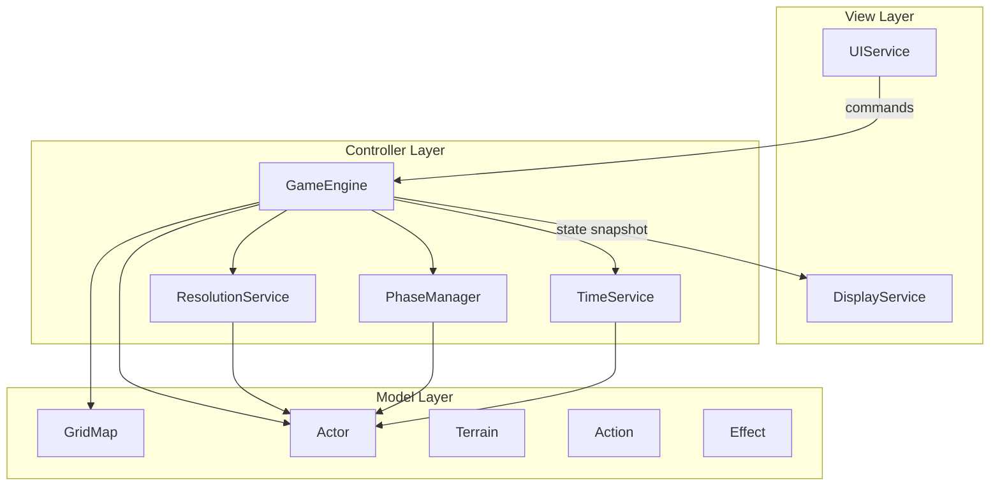
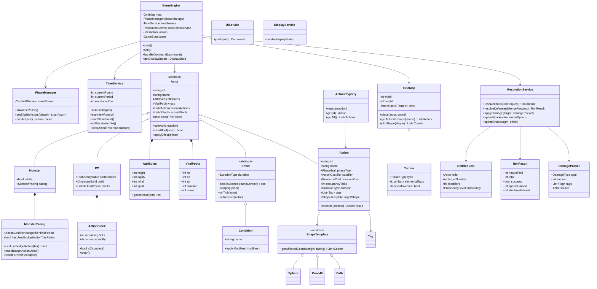
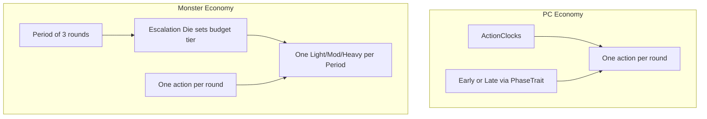
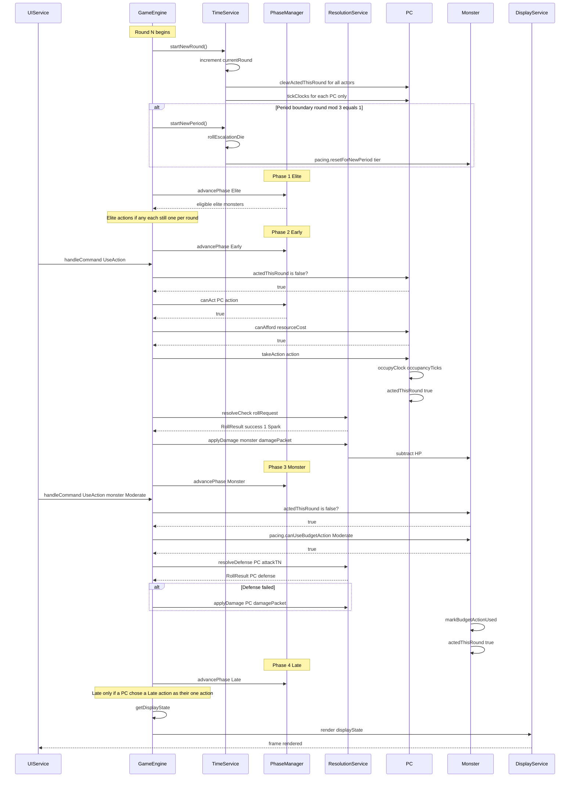

# SDD: Hackfinder Game Engine — Class Diagram

**Version:** 0.2  
**Status:** Draft  
**Source rules:** [gameRules/version_0.01.md](../gameRules/version_0.01.md)  
**Language:** TypeScript (chosen for eventual Foundry VTT compatibility; Foundry integration is out of scope for this project)

---

## 1. Purpose

This document defines the object-oriented class model for the Hackfinder game engine. It translates the rules in `version_0.01.md` into a formal architecture before any code is written. The design follows MVC layering: **Model** (data), **Controller** (rules and orchestration), **View** (input/output services with no rule knowledge).

Where this SDD clarifies or supersedes the rules bible for engine design, see [§13 Clarifications vs Rules Bible](#13-clarifications-vs-rules-bible).

---

## 2. Architecture Overview

### 2.1 MVC Layers

| Layer | Classes | Responsibility |
|-------|---------|----------------|
| **View** | `UIService`, `DisplayService` | Capture user input and render output. Must not contain game-rule logic. |
| **Controller** | `GameEngine`, `PhaseManager`, `TimeService`, `ResolutionService` | Orchestrate combat flow, enforce rules, resolve checks. |
| **Model** | `Actor`, `GridMap`, `Terrain`, `Action`, `Effect` | Hold game state and domain data. |

### 2.2 Data Flow



**Constraint:** `DisplayService` receives a `DisplayState` snapshot only. It must not import or reference game-rule classes. `GameEngine` is the sole authority on rules.

### 2.3 TypeScript Module Layout

Target package structure for the TypeScript engine:

```
engine/
  core/           GameEngine, GameState, Command
  phases/         PhaseManager, CombatPhase
  time/           TimeService, ActionClock
  resolution/     ResolutionService, RollRequest, RollResult, DamagePacket
  model/
    actors/       Actor, PC, Monster, Attributes, VitalPools, MonsterPacing
    actions/      Action, ActionRegistry
    effects/      Effect, Condition
    grid/         GridMap, Coord, Terrain, shapes/
    progression/  (deferred) CharacterBuild, Core, Archetype
  services/
    ui/           UIService
    display/      DisplayService, DisplayState
```

`ActionClock` lives under `time/` but is **owned only by `PC`** (composition on `PC`, not on abstract `Actor`).

---

## 3. Core Class Diagram



---

## 4. Per-Class Responsibilities

| Class | Layer | Responsibility |
|-------|-------|----------------|
| `GameEngine` | Controller | Master state machine and main loop. Owns all actors and services. Routes commands, advances rounds/phases, produces `DisplayState`. |
| `GameState` | Controller | Enum or value object tracking encounter lifecycle (Setup, InCombat, Paused, Ended). |
| `PhaseManager` | Controller | Tracks current `CombatPhase`. Determines which actors may act and validates action phase traits and one-action-per-round. |
| `TimeService` | Controller | Round counter; ticks **PC** action clocks only; clears `actedThisRound`; GM Periods (3 rounds); Escalation Die rolls; resets monster period budgets. |
| `ResolutionService` | Controller | All D20 math: checks vs TN, defense rolls, Sparks/Shadows generation, damage application, meta-currency spending. |
| `UIService` | View | Polls hardware input (keyboard, mouse, network). Returns `Command` objects to `GameEngine`. |
| `DisplayService` | View | Renders a `DisplayState` snapshot. Swappable backend (ASCII, React, terminal). |
| `GridMap` | Model | 2D coordinate space. Actor placement, terrain lookup, geometric shape plotting. |
| `Coord` | Model | Immutable (x, y) grid coordinate value object. |
| `Actor` | Model | Abstract base for combatants. Composes attributes, vitals, actions, effects; tracks `actedThisRound`. **Does not own clocks.** |
| `PC` | Model | Player character. Owns `ActionClock`s (v0.1: 2), proficiency table, and character build reference. |
| `Monster` | Model | Non-PC combatant (enemies; future allies/minions may reuse this or a later subtype). Owns `isElite` and `MonsterPacing`. **No clocks.** |
| `MonsterPacing` | Model | Period budget from Escalation Die; whether this monster has used its one Light/Moderate/Heavy action this Period. |
| `Attributes` | Model | Four core attributes: Might, Agility, Mind, Spirit. Provides defense lookups. |
| `VitalPools` | Model | Five resource pools: HP, EP, SP, Stamina, Mana. |
| `Action` | Model | Encapsulates one game action: phase trait, cost, occupancy, tags, target shape, and `execute()`. |
| `ActionRegistry` | Model | Central catalog of all defined actions. Lookup by ID. |
| `ActionClock` | Model | **PC-only.** Tracks remaining ticks and which action occupies the clock. |
| `Effect` | Model | Abstract timed or triggered modifier on an actor. Handles duration expiry. |
| `Condition` | Model | Concrete `Effect` subclass for named debuffs/buffs (e.g., Challenged, Stance). |
| `Terrain` | Model | Grid cell terrain: type, elemental tags, movement blocking. |
| `ShapeTemplate` | Model | Abstract geometric area-of-effect template (Sphere, Cone45, Path). |
| `RollRequest` | Model | Input DTO for a single D20 check. |
| `RollResult` | Model | Output DTO: natural roll, total, success, Sparks/Shadows earned. |
| `DamagePacket` | Model | Typed damage payload: type, amount, tags, source actor. |
| `ProficiencyTable` | Model | Maps skill/action categories to `ProficiencyLevel`. |
| `CharacterBuild` | Model | (Deferred) Core, Archetypes, Ancestry, level, feat selections. |
| `DisplayState` | View DTO | Immutable render snapshot: grid, actor positions, HP bars, phase, round. |
| `Command` | View DTO | User intent from `UIService`: UseAction, MoveActor, SpendSpark, EndPhase, etc. |

---

## 5. Enums and Value Objects

### 5.1 `CombatPhase`

The four synchronous phases per round. One full cycle = 1 Round (1 Tick).

| Value | Description |
|-------|-------------|
| `Elite` | Elite monsters only. Actions with Elite trait. |
| `Early` | PCs whose **one** action this round has the Early trait. |
| `Monster` | Standard (and optionally Elite) monsters act. |
| `Late` | PCs whose **one** action this round has the Late trait. |

### 5.2 `PhaseTrait`

Tag on an `Action` indicating when it may be used.

| Value | Used by | Description |
|-------|---------|-------------|
| `Elite` | Elite monsters | Elite Phase only. |
| `Early` | PCs | Early Phase — selects which phase the PC’s single action resolves in. |
| `Late` | PCs | Late Phase — selects which phase the PC’s single action resolves in. |
| `Quick` | Monsters (non-budget rounds), PCs | Minor actions. **Counts as the actor’s one action for the round** when chosen (v0.1: no free Quick on top of a Standard action). |

### 5.3 `ActionCostTier`

Resource cost category for an action.

| Value | Resource cost | Monster Period notes |
|-------|---------------|----------------------|
| `AtWill` | 0 | Not a Period budget action. |
| `Light` | 2 Stamina or Mana | Budget-tier; Escalation Die must allow Light (or higher); one per monster per Period. |
| `Moderate` | 4 resources | Budget-tier; Escalation Die must allow Moderate (or higher); one per monster per Period. |
| `Heavy` | 6 resources | Budget-tier; Escalation Die must allow Heavy; one per monster per Period. |

For monsters, Light / Moderate / Heavy are the **Period budget** tiers. Escalation Die sets `budgetTierThisPeriod`. A monster may spend that budget on **at most one** such action per Period. Other rounds in the Period must use Quick (or At-Will non-budget) actions only.

### 5.4 `DurationType`

How long an effect or action consequence persists.

| Value | Tracking behavior |
|-------|-------------------|
| `Instantaneous` | No tracking. Applied and done. |
| `TickBound` | Expires at end of next tick (1–2 rounds max). |
| `ClockBound` | Lasts while a **PC** clock remains intentionally occupied. |
| `EventBased` | Until a specific trigger or counteract roll clears it. |
| `EncounterLong` | Until encounter ends (e.g., Stances). |
| `Daily` | Until one in-game day passes. |
| `DowntimeBound` | Until a Long Rest (1 full week of downtime). |

Engine v0.1 implements `Instantaneous` through `EncounterLong` only.

### 5.5 `DamageType`

Capital-D damage types. Subtract from HP or SP only.

| Value | Targets | Notes |
|-------|---------|-------|
| `Kinetic` | HP | Mitigated by physical armor dice. |
| `Energy` | HP | Non-physical baseline. |
| `Explosive` | HP | Ignores PC physical armor dice. |
| `Cognitive` | Monster HP / Player SP | Bypasses player HP entirely. |
| `Lingering` | HP | Damage over time. Requires time/event to clear. |

### 5.6 `ProficiencyLevel`

Access rights and modifier for checks.

| Value | Modifier | Notes |
|-------|----------|-------|
| `Untrained` | +0 (with -5 penalty on use) | Cannot access restricted gear or Spark Menus. |
| `Trained` | +2 | Base access rights. |
| `Expert` | +4 | Unlocks advanced Spark Menus. |
| `Master` | +6 | Top-tier gear access. |
| `Legendary` | +8 | Maximum proficiency. |

### 5.7 `Tag`

Narrative and mechanical labels on actions, damage, and terrain. Tags drive environmental interactions and **which Spark Menu unlocks** on a +5-over-TN roll.

Examples: `Area`, `Fire`, `Void`, `Slashing`, `Toxin`, `Knockback`, `Bludgeoning`, `Concussive`.

Implemented as a string enum or sealed set. New tags can be added without changing core engine classes.

### 5.8 `TerrainType`

Classification for grid cells.

Examples: `Open`, `Difficult`, `Obstacle`, `ElementalZone`.

Elemental zones carry additional `Tag` values (e.g., `Fire`, `Void`).

### 5.9 `ResourceCost`

Value object specifying which vital pools an action consumes.

```
ResourceCost {
  stamina?: int
  mana?: int
  sp?: int
  ep?: int
}
```

At least one pool may be set. `Actor.canAfford()` checks against `VitalPools`.

### 5.10 `DisplayState`

Immutable snapshot produced by `GameEngine.getDisplayState()`. Consumed only by `DisplayService`.

```
DisplayState {
  grid: GridSnapshot          // cells, terrain icons, dimensions
  actors: List<ActorSnapshot> // id, name, position, hp/maxHp, status icons
  currentPhase: CombatPhase
  currentRound: int
  currentPeriod: int
  messages: List<string>     // recent log entries for UI
}
```

`DisplayService` must not reach into live `Actor` or `GridMap` objects.

### 5.11 `Command`

User intent from `UIService`, processed by `GameEngine.handleCommand()`.

| Variant | Payload | Description |
|---------|---------|-------------|
| `UseAction` | actorId, actionId, target?, origin?, facing? | Execute an action. |
| `MoveActor` | actorId, destination: Coord | Movement as the actor’s one action (typically Quick). |
| `SpendSpark` | actorId, menuOptionId | Spend earned Sparks on a rider effect. |
| `SpendShadow` | effectId | GM spends Shadows on a punishment. |
| `EndPhase` | — | Advance to next combat phase (GM or auto). |
| `EndRound` | — | Force round completion (testing/debug). |

---

## 6. Action Extension Pattern

### Decision: Hybrid — `Action` base class + `ActionRegistry`

**Rationale:** Hackfinder will have dozens to hundreds of actions across Cores, Archetypes, spells, and techniques. A pure subclass-per-action approach creates class-file sprawl and makes data-driven tooling (VTT action builder, JSON import) harder. A pure function registry loses type safety and makes complex multi-step actions awkward.

### Pattern

1. **`Action` base class** holds shared metadata: `id`, `name`, `phaseTrait`, `costTier`, `resourceCost`, `occupancyTicks`, `duration`, `tags`, `targetShape`.
2. **`execute(context: ActionContext): ActionResult`** is the single extension point. `ActionContext` provides the acting actor, targets, grid reference (via engine), and current phase/round.
3. **`ActionRegistry`** is a singleton or engine-owned catalog. All standard actions register at startup. Lookup by `id`.
4. **Subclass `Action`** only when an action has unique state or multi-step logic that does not fit a simple execute delegate (e.g., `CommanderClockShareAction`, `PsionicGuardAegisPulse`). These subclasses still register in `ActionRegistry`.
5. **Actors hold references** to `Action` instances (or action IDs resolved through the registry), not string names.

### Registration example (pseudocode)

```
registry.register(new Action(
  id: "strike",
  name: "Strike",
  phaseTrait: Early,
  costTier: Light,
  resourceCost: { stamina: 2 },
  occupancyTicks: 0,
  duration: Instantaneous,
  tags: [Slashing],
  execute: (ctx) => resolutionService.resolveAttack(ctx)
))

registry.register(new AegisPulseAction())  // subclass for Core-specific logic
```

### Rules enforced by `GameEngine` before `execute()`

1. `!actor.actedThisRound` — exactly one action per actor per round.
2. `PhaseManager.canAct(actor, action)` — correct phase and actor type / phase trait.
3. `actor.canAfford(action.resourceCost)` — sufficient vitals.
4. **If `PC`:** open `ActionClock` available when the action occupies a clock (Quick with zero occupancy may skip occupancy; still counts as the round’s one action).
5. **If `PC`:** action not already occupying a different clock.
6. **If `Monster`:** when `costTier` is Light, Moderate, or Heavy — Escalation Die budget tier allows it and `!pacing.hasUsedBudgetActionThisPeriod`.
7. On success: set `actor.actedThisRound = true`; for monster budget actions, call `pacing.markBudgetActionUsed()`.

---

## 7. Key Design Decisions

### 7.1 Actor composition over inheritance

`PC` and `Monster` differ in supplemental data and economy, not in how core stats are stored. Both share `Attributes`, `VitalPools`, and `Effect` lists via composition on `Actor`.

- **`PC`:** owns `ActionClock`s + `ProficiencyTable` / `CharacterBuild`.
- **`Monster`:** owns `MonsterPacing` + `isElite`. No clocks. No separate `NPC` class.

### 7.2 One action per round

Every combatant may take **exactly one action per round**, tracked by `Actor.actedThisRound`. Cleared in `TimeService.startNewRound()`.

- **PCs:** Early vs Late is **which phase** that single action resolves in (via `PhaseTrait`), not two PC actions per round.
- **Quick:** counts as the round’s one action when chosen. No free Quick stacked on a Standard action in v0.1.
- **Minions/summons:** may later break this rule; undesigned — see OQ-09.

### 7.3 PC clocks vs Monster Period pacing



- **PC:** Standard actions occupy clocks for N ticks. Clocks tick down only for PCs at round start.
- **Monster:** Escalation Die at Period start sets `budgetTierThisPeriod`. One Light/Moderate/Heavy action allowed per monster per Period (must not exceed the rolled tier). Other rounds: Quick / non-budget only.
- Elite Phase eligibility still uses `Monster.isElite` + Elite-trait actions.

### 7.4 Effect hierarchy for durations

Seven duration types map to `Effect.duration: DurationType`. `TimeService` and `PhaseManager` call `effect.isExpired(context)` each tick rather than encoding duration logic on `Actor`.

### 7.5 ResolutionService owns all D20 math

`GameEngine` orchestrates; `ResolutionService` computes TN checks, Sparks (+5 bands), Shadows (-5 bands), nat 20/1 bonuses, and untrained -5 penalty. Isolated for unit testing.

### 7.6 PhaseManager + TimeService split

- **PhaseManager:** which phase, who can act, action trait validation, one-action gate coordination with engine.
- **TimeService:** round counter, **PC-only** clock tick-down, clear `actedThisRound`, GM Period (3 rounds), Escalation Die, reset `MonsterPacing` for new Period.

### 7.7 GridMap owns space; Actor owns self

`GridMap` tracks coordinates and terrain. `Actor` has no grid awareness. `GameEngine` mediates placement and shape queries.

### 7.8 Display boundary

`GameEngine.getDisplayState()` projects internal model to `DisplayState`. Any renderer (ASCII, React, terminal) implements `DisplayService` against that DTO.

### 7.9 Elite monsters are a flag, not a subclass

`Monster.isElite: bool` gates Elite Phase eligibility. Elites may also act during Monster Phase. No `EliteMonster` subclass needed.

---

## 8. Sequence Diagram: One Full Round

Round start clears `actedThisRound` and ticks **PC clocks only**. Shows one PC Early action and one monster budget-tier action with defense.



---

## 9. Engine v0.1 Scope

### 9.1 In Scope

| System | Classes | Notes |
|--------|---------|-------|
| Main loop | `GameEngine`, `GameState` | Round → 4 phases → tick **PC** clocks; one action per actor per round |
| Actors | `Actor`, `PC`, `Monster`, `Attributes`, `VitalPools` | Hierarchy is PC + Monster only |
| Action economy | `Action`, `ActionRegistry`, `ActionClock`, `MonsterPacing` | PC clocks; monster Period/Escalation budget |
| Phases | `PhaseManager`, `CombatPhase` | All 4 phases |
| Timekeeping | `TimeService` | Rounds, PC clocks, periods, escalation die |
| Resolution | `ResolutionService`, `RollRequest`, `RollResult`, `DamagePacket` | D20 vs TN, Sparks/Shadows |
| Grid | `GridMap`, `Coord`, `Terrain`, `ShapeTemplate` | Sphere, Cone45, Path |
| Effects | `Effect`, `Condition` | Duration types 1–5 (through EncounterLong) |
| View stubs | `UIService`, `DisplayService`, `DisplayState`, `Command` | Headless, ASCII, or React sheet later |
| Reference Core | One Core engine (Psionic Guard recommended) | Validates Core-as-Action-subclass pattern |

### 9.2 Out of Scope

| System | Reason |
|--------|--------|
| `NPC` class / `Disposition` | Collapsed into `Monster`; disposition not tracked for now |
| Minions / summons | Undesigned; may alter one-action-per-round later |
| Full `CharacterBuild` / leveling matrix (0–12) | Progression is data-heavy; combat kernel first |
| All 8 Core engines | One reference Core proves the pattern |
| Armor dice mitigation | Shield/armor mini-game deferred |
| Shield reactions (Block, Parry) | Deferred with armor system |
| Archetype resource recharge | Requires full Archetype data |
| Daily / DowntimeBound durations | Non-combat timekeeping not needed yet |
| Networking / multiplayer VTT | Local sandbox first |
| Foundry VTT integration | Out of project scope; TypeScript chosen for eventual compatibility |
| Spark Menu content | Engine generates Sparks; menu content is data |

---

## 10. Open Questions

Items marked placeholder or underspecified in `version_0.01.md`. Resolve before implementing the affected subsystem.

| ID | Topic | Status | Notes |
|----|-------|--------|-------|
| OQ-01 | **Knight Core engine** | Placeholder in rules | "Heroic interception and forced targeting abilities" — no mechanics defined. Do not implement until rules are written. |
| OQ-02 | **Generic Cores** (Defender, Striker, Tactician, Controller) | Placeholder in rules | Flavor-only stubs. Wait for distinct mechanics before creating classes. |
| OQ-03 | **TN-by-level table** | Referenced, not defined | `ResolutionService` needs a `TargetNumberTable` or formula. Define in gameRules before implementation. |
| OQ-04 | **Mana governing attribute** | Archetype-dependent | Mind or Spirit per Archetype. Engine needs Archetype data to resolve which pool powers an action. Deferred with progression. |
| OQ-05 | **Spark Menu definitions** | Tags drive menu selection | Engine earns Sparks; menu content and rider effects are data, not engine logic. Define separately. |
| OQ-06 | **Escalation Die faces** | Mechanic described, values not listed | What die? What faces map to Light/Moderate/Heavy budget? Define before `TimeService` / `MonsterPacing` implementation. |
| OQ-07 | **Clock count by level** | "2 clocks, more at higher levels" | Level progression deferred. v0.1 hardcodes 2 clocks per PC. |
| OQ-08 | **Cognitive damage vs SP** | Bypasses HP for players | Confirm: does Cognitive damage always target SP, or does it depend on target type? Rules say "drains Player SP" — implement as target-type check. |
| OQ-09 | **Minions / summons** | Undesigned | May not follow one-action-per-round. Do not invent engine exceptions until rules exist. |
| OQ-10 | **Friendly non-PC combatants** | Deferred | Allies / summons are not an `NPC` class. Model as `Monster` or a later subtype when designed. |

---

## 11. Relationship to Rules Doc

| Rules section | Engine classes |
|---------------|----------------|
| §1 VTT Architecture | `UIService`, `DisplayService`, `GridMap`, `Actor`, `Terrain`, `GameEngine`, `PhaseManager`, `TimeService`, `ResolutionService` |
| §2 Combat Flow | `PhaseManager`, `TimeService`, `ActionClock` (PC), `MonsterPacing`, `Action`, `PhaseTrait` |
| §3 Resolution | `ResolutionService`, `RollRequest`, `RollResult`, `ProficiencyLevel` |
| §4 Attributes & Vitals | `Attributes`, `VitalPools` |
| §5 Damage & Tags | `DamagePacket`, `DamageType`, `Tag` |
| §6 Equipment & Shields | Deferred (out of v0.1 scope) |
| §7 Progression Matrix | `CharacterBuild`, `ProficiencyTable` (deferred) |
| §8 Core Chassis | Reference Core as `Action` subclass (one in v0.1) |

---

## 12. Revision History

| Version | Date | Changes |
|---------|------|---------|
| 0.1 | 2026-07-28 | Initial class diagram SDD |
| 0.2 | 2026-07-28 | TypeScript target; remove NPC/Disposition; PC-only ActionClocks; one action per round; Monster Period/Escalation pacing via MonsterPacing; clarifications vs rules bible |

---

## 13. Clarifications vs Rules Bible

This SDD **supersedes** the following for engine design (rules bible may lag until next gameRules revision):

| Topic | Rules bible / older sketch | Engine design (this SDD) |
|-------|----------------------------|---------------------------|
| Language | Unspecified / agnostic | **TypeScript** |
| Actor subclasses | PC / NPC / Monster | **PC / Monster only** — no `NPC` |
| Disposition | Mentioned for NPCs | **Not tracked** for now |
| Action clocks | Implied on actors generally | **PC-only** (`ActionClock` on `PC`) |
| Monster economy | Periods + Escalation Die | Unchanged intent; formalized as `MonsterPacing` (one budget-tier action per monster per Period) |
| Actions per round | Not stated as a hard cap | **Exactly one action per actor per round** (`actedThisRound`) |
| PC Early + Late | Separate phases for Early/Late traits | Same phases; Early/Late chooses **when** the PC’s single action resolves |
| Quick actions | Usable while clocks on cooldown | Still usable under clock rules, but **counts as the round’s one action** in v0.1 |
| Foundry | Mentioned as future VTT host | Out of project scope; TS chosen for eventual compatibility |
| Minions / summons | Not designed | Deferred (OQ-09) |
